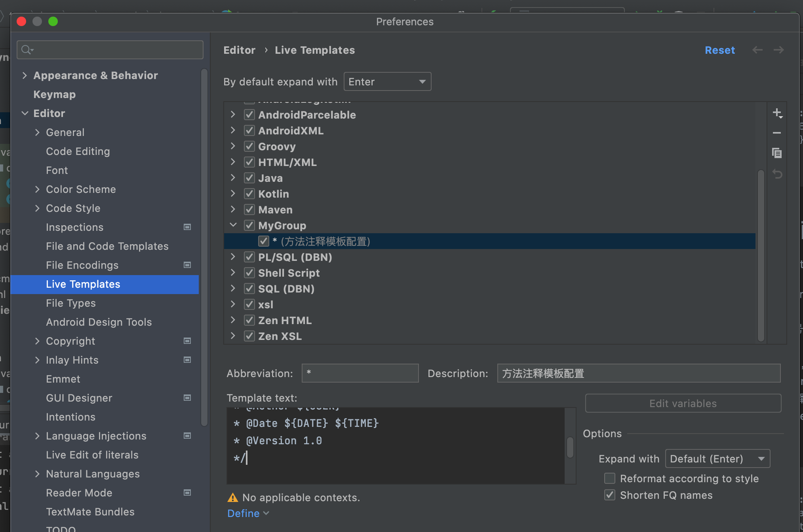

## 类注释
Settings > Editor > File and Code Templates > Includes > File Header
```
/**
 * @Description: TODO 
 * @Author ${USER}
 * @Date ${DATE} ${TIME}
 * @Version 1.0
 */
```

## 自定义模版配置（类，方法）

File > Settings > Editor > Live Templates
1. By default expand with Enter(修改默认使用Enter的方式使用注释模板)
2. 点击右边的”+“号,选择Template Group 
3. 创建自己的组名 
4. 选择自己的组名，点击”+”号，选择Live Template 
5. 填写Abbreviation，Description，Template text
6. 点击 Define 选择java，也可以选择everywhere
7. 设置Edit variables

Template text:
```
*
 * @Description: TODO 
 * @Param ${param}
 * @Return ${return}
 * @Author ${USER}
 * @Date ${DATE} ${TIME}
 * @Version 1.0
 */
```



